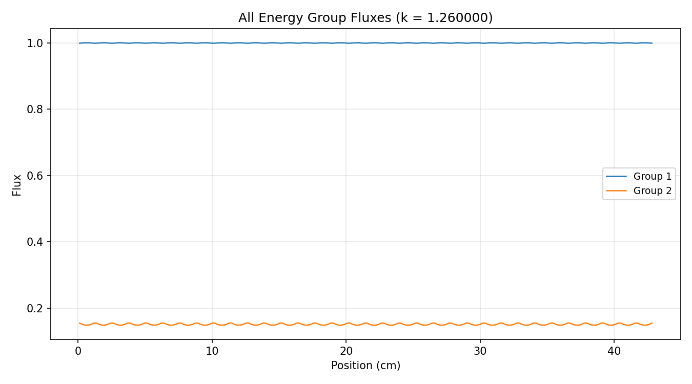
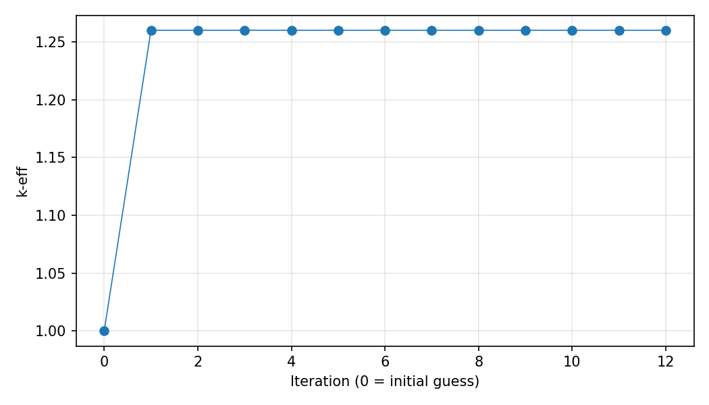

# 1-D Fission Reactor Monte Carlo

Multigroup **1-D neutron transport** for pin-cell / assembly slab geometries — a Monte Carlo k-eigenvalue solver paired with a finite-difference diffusion reference.

Built for ENU6106-style reactor analysis: UO₂ and MOX fuel, 2-group and 7-group cross sections, reflective or vacuum boundaries, and power-normalized flux / current tallies.

<p align="center">
  
</p>

<p align="center"><em>Example: 2-group finite-difference flux (UO₂–UO₂ configuration)</em></p>

---

## Features

- **Monte Carlo transport** (`fission1d/monte_carlo.py`) — history-based particle tracking with fission source iteration, track-length flux and surface current tallies, optional Numba acceleration
- **Finite-difference diffusion** (`fission1d/finite_diff.py`) — multigroup diffusion k-eigenvalue solver with power iteration (verification / reference)
- **Input decks** — human-readable `.txt` cross-section and geometry files, parsed to JSON
- **Analysis scripts** — verification sweeps, flux/current plots, group collapse, and extra-credit configurations

---

## Repository layout

```text
.
├── data/                      # Input decks + parsed JSON
│   ├── project2groupData.txt
│   ├── project7groupData.txt
│   ├── parsed_output_2_group.json
│   └── parsed_output_7_group.json
├── fission1d/                 # Core Python package
│   ├── parser.py
│   ├── monte_carlo.py
│   └── finite_diff.py
├── scripts/                   # Runnable analysis / plotting CLIs
├── results/                   # Generated outputs (gitignored)
└── docs/figures/              # Curated example plots for the README
```

---

## Setup

```bash
python -m venv .venv
source .venv/bin/activate          # Windows: .venv\Scripts\activate
pip install -r requirements.txt
```

Numba is optional but strongly recommended for Monte Carlo runs. Without it, use `--engine python`.

---

## Quick start

Run commands from the repository root so the `fission1d` package is importable.

### 1. Parse input decks (optional)

Pre-parsed JSON already lives in `data/`. Re-generate after editing a `.txt` deck:

```bash
python -m fission1d.parser --energy-groups 2
python -m fission1d.parser --energy-groups 7
```

### 2. Monte Carlo (smoke test)

Defaults keep generations/histories small unless you pass `--full`:

```bash
python -m fission1d.monte_carlo --energy-groups 2 --config 0 --engine python
```

Full-size run (uses generations/histories from the input file):

```bash
python -m fission1d.monte_carlo --energy-groups 2 --config 0 --full --engine numba
```

Useful flags: `--case`, `--config`, `--generations`, `--histories`, `--seed`, `--output-dir`, `--no-save`.

### 3. Finite-difference reference

```bash
python -m fission1d.finite_diff --energy-groups 2 --config 0
python -m fission1d.finite_diff --energy-groups 7 --config 1 --mesh-refinement 2
```

Plots and convergence curves are written under `results/finite_diff/`.

---

## Analysis scripts

| Script | Purpose |
|--------|---------|
| `scripts/verify_finite_diff.py` | FD flux comparison + mesh convergence study |
| `scripts/verify_monte_carlo.py` | MC verification / generation & skip sweeps |
| `scripts/plot_monte_carlo.py` | Run all configs; plot power-normalized flux & current |
| `scripts/plot_finite_diff.py` | Run all FD configs; summary table + flux plots |
| `scripts/plot_collapsed.py` | Collapse 7-group → 2-group and compare |
| `scripts/plot_extracredit.py` | Extra configurations (reflector, control rods, …) |

Example:

```bash
python scripts/plot_finite_diff.py --energy-groups 2
python scripts/verify_finite_diff.py
```

Generated figures land in `results/` (not committed). A couple of representative plots are kept in `docs/figures/` for documentation.

---

## Problem setups

| Energy groups | Configs | Materials |
|---------------|---------|-----------|
| 2 | UO₂–UO₂, MOX–MOX | UO₂, MOX, H₂O, control rod |
| 7 | UO₂–UO₂, MOX–MOX, UO₂–MOX | same |

Geometry is a 1-D slab of fuel assemblies with pin pitch / water / fuel meshing controlled by `NumRods`, `RodPitch`, `MPFR`, and `MPWR` in the input decks.

---

## Method sketch

**Monte Carlo**

1. Sample fission birth sites (flat fuel guess, then fission bank)
2. Track neutrons: free flight → collision or mesh/boundary crossing
3. Score track-length flux and surface currents; bank fission neutrons
4. Estimate \(k\) each generation; average after skipped inactive generations

**Finite difference**

1. Build a multigroup diffusion matrix on the 1-D mesh
2. Power-iterate on the fission source until \(k\) and flux converge
3. Recover edge currents from Fick’s law for comparison with MC

<p align="center">
  
</p>

---

## Outputs

| Location | Contents |
|----------|----------|
| `results/monte_carlo/` | `.npz` tallies + `.meta.json` run metadata |
| `results/finite_diff/` | Flux, current, and convergence PNGs |
| `results/*/` | Script-specific verification / plot folders |

---

## License

Personal academic project — use and adapt with attribution.
